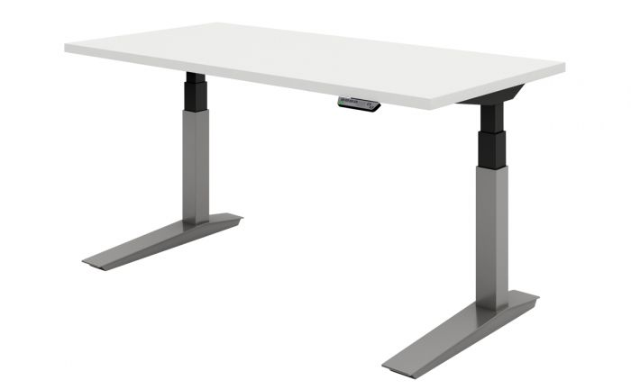
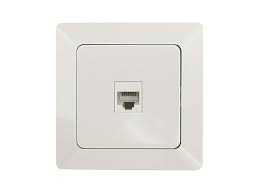
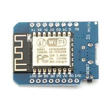
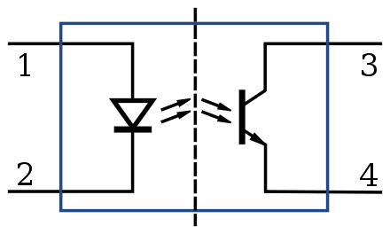

# IoT
### Internet of Tables

---

# Upplägg

1. Hur kopplar man upp ett skrivbord?
2. Vad är "esp8266" och hur programmerar man den?
3. Hur kopplar vi ihop alla delar?
4. Workshop / Fri hacktid

---

# Skrivbord



--

## Standard RJ45-uttag




--

## Koppling

* Blå - 5V
* Brun - GND (ner)
* Blå/Vit - GND (upp)

Kortslut blå med brun eller blå/vit för att styra bordet.

--

## Våra skrivbord

* Två RJ45-uttag
  1. För knapparna
  2. För att hacka

---

# Esp8266



--

## Specs

* 80 MHz
* 80 KiB RAM
* 4 MiB Flash
* IEEE 802.11 b/g/n wifi
* 16 GPIO pins
* ~ $1

--

# Programmera

```C
void setup() {
  pinMode(BUILTIN_LED, OUTPUT);
}

void loop() {
  digitalWrite(BUILTIN_LED, HIGH);
  delay(1000);
  digitalWrite(BUILTIN_LED, LOW);
  delay(1000);
}
```
Setup och exempel på [github.com/PontusPersson/internetoftables](github.com/PontusPersson/internetoftables)

---

# Hårdvara

* esp8266
* 2 x optokopplare (CNY17F)
* 2 x 200-ohm motstånd
* RJ45-uttag
* breadboard och kablar

--

## Optokopplare



--

# Vår setup


---

# Setup

1. Installera Arduino IDE
2. Installera [serial driver](https://wiki.wemos.cc/_media/ch341ser_win_3.4.zip)
3. Lägg till [esp8266.json](http://arduino.esp8266.com/stable/package_esp8266com_index.json]) under Preferences -> Additional Board Manager Urls i Arduino IDE
4. Installera Tools -> Board -> Board manager -> ESP8266

--

# Blink

5. Välj Tools -> Board -> LOLIN(WEMOS) D1 R2 & mini
6. Koppla in esp8266 med usb
7. Välj Tools -> Port -> COMX (X kan vara något annat)
8. Öppna File -> examples -> esp8266 -> blink
9. Tryck "Upload"

---

# Hack time!

[github.com/PontusPersson/internetoftables](github.com/PontusPersson/internetoftables)